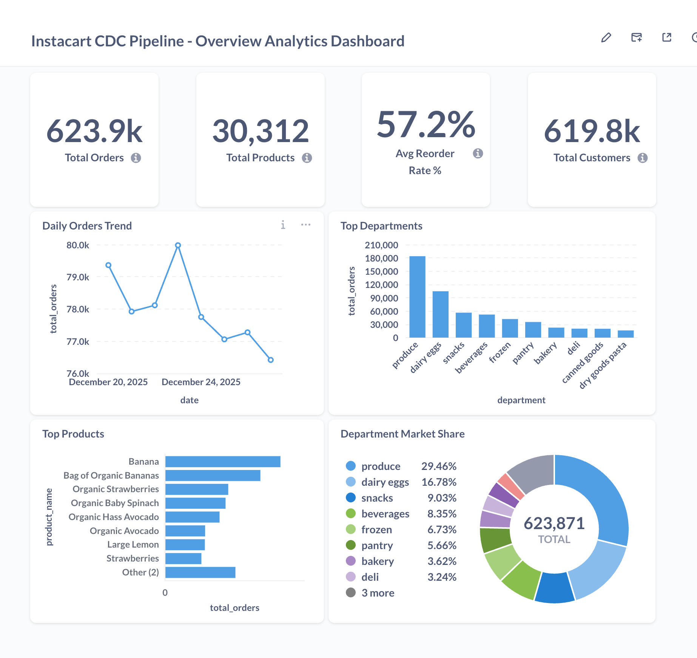
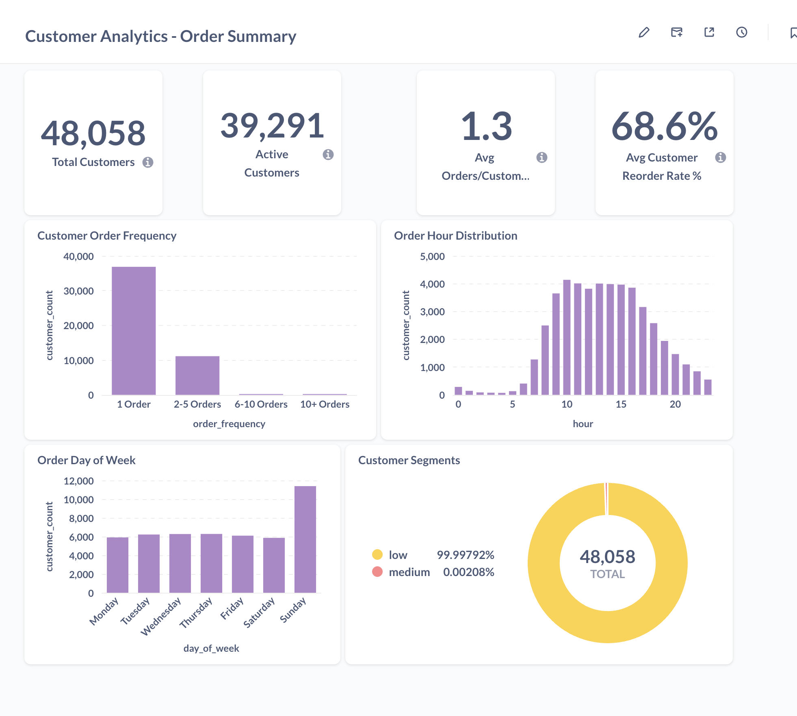

# CDC DATA PIPELINE ON Google Cloud

## Overview
Real-time Change Data Capture (CDC) pipeline implementing Medallion Architecture (Bronze/Silver/Gold) to process streaming changes from PostgreSQL transactional database and deliver analytics-ready data for business intelligence.


## High-Level Data Flow

```
PostgreSQL (Instacart Orders)
    ↓ (pgoutput plugin)
Debezium Server
    ↓ (JSON CDC events)
Apache Kafka (Topics)
    ↓ (Structured Streaming)
Bronze Layer (Delta Lake - Raw CDC)
    ↓ (Structured Streaming + SCD2)
Silver Layer (Delta Lake - Curated)
    ↓ (Batch Processing)
Gold Layer (Delta Lake - Aggregated)
    ↓ (JDBC/Thrift)
Metabase Dashboards
```

## Infrastructure Topology

### 3-Node GCP Cluster

**Node 1: Source & Ingestion (`cdc-source-node`)**
- PostgreSQL (Source DB, port 5432)
- Debezium Server (CDC capture, HTTP 8080)
- Kafka Broker (port 9092)
- Zookeeper (port 2181)
- Jupyter Notebook (development, port 8888)
- Data Generation Service

**Node 2: Spark Master (`cdc-spark-master-node`)**
- Spark Master (cluster management, port 7077, Web UI 8080)
- Spark Worker (executor, Web UI 8081)
- Spark Thrift Server (JDBC, port 10000)

**Node 3: Processing & Visualization (`cdc-spark-worker-node`)**
- Spark Worker (executor, Web UI 8081)
- Metabase (dashboards, port 3000)
- PostgreSQL (Metabase metadata)

**Shared Storage:**
- GCS Buckets: `cdc-bronze-layer`, `cdc-silver-layer`, `cdc-gold-layer`


## Medallion Architecture

### Bronze Layer (Raw Ingestion)
**Purpose:** Preserve complete CDC event history with full Debezium envelope

**Characteristics:**
- **Mode:** Spark Structured Streaming
- **Tables:** `orders`, `order_products`, `products`, `aisles`, `departments`
- **Schema:** Full Debezium envelope (before/after/source/op/ts_ms)
- **Write Mode:** Append-only
- **Trigger:** 10 seconds
- **Deduplication:** None (complete event log)

**Key Fields:**
- `before`: Previous row state (null for inserts)
- `after`: Current row state (null for deletes)
- `source`: LSN, transaction ID, table metadata
- `op`: Operation type (c=create, u=update, d=delete, r=read)
- `ts_ms`: Event timestamp

### Silver Layer (Curated Data)
**Purpose:** Business-ready tables with data quality, type 2 slowly changing dimensions, and standardized schemas

**Dimension Tables (SCD Type 2):**
- `dim_product`, `dim_aisle`, `dim_department`
- **Features:**
  - Surrogate keys (`product_sk`, `aisle_sk`, `department_sk`)
  - Business keys (`product_id`, `aisle_id`, `department_id`)
  - Temporal tracking: `eff_start_date`, `eff_end_date`, `is_current`
  - Change detection: `row_hash` (MD5 of business columns)
  - Full historical versioning

**Fact Tables (Append-Only with Soft Deletes):**
- `fact_order`, `fact_order_product`
- **Features:**
  - Primary key deduplication
  - `is_deleted` flag for CDC deletes
  - `cdc_operation` metadata
  - `processed_timestamp` for audit

**Mode:** Spark Structured Streaming
**Trigger:** 10 seconds
**Smart Features:**
- Micro-batch deduplication (latest event wins)
- Row-level change detection via hashing
- Incremental merge operations

### Gold Layer (Aggregated Analytics)
**Purpose:** Pre-computed business metrics optimized for reporting

**Tables:**
- `product_performance_daily`: Daily product sales metrics
- `customer_order_summary`: Customer lifetime value and behavior
- `order_hourly_patterns`: Temporal ordering patterns

**Characteristics:**
- **Mode:** Spark Batch (scheduled)
- **Trigger:** 900 seconds (15 minutes)
- **Write Mode:** Complete overwrite
- **Source:** Silver layer facts and dimensions


# Dashboards

- Overview Dashboard


- Customer Order Summary Dashboard
